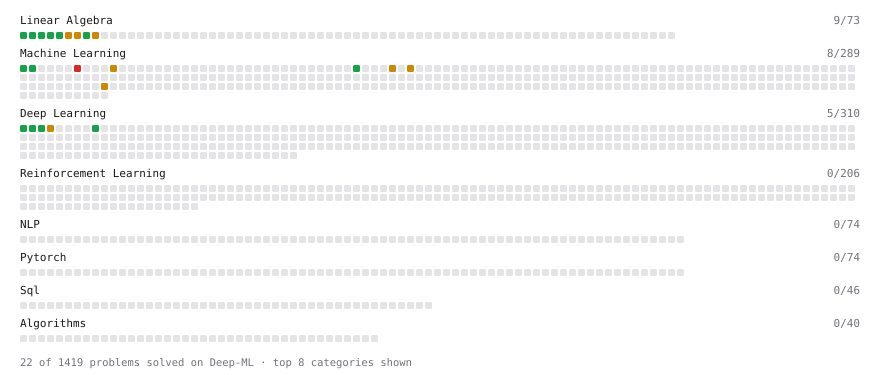

# Deep-ML

My machine learning practice from [Deep-ML](https://www.deep-ml.com). Every solution here was written by hand.

**20** solved · 20 problems · 0 labs · 0 math

[**Browse the interactive portfolio**](https://porzlck.github.io/deep-ml/) to replay this filling in over time.

## Problems

| | Difficulty | Solved | |
| --- | --- | --- | --- |
| [Calculate 2x2 Matrix Inverse](https://www.deep-ml.com/problems/8) | easy | 2026-01-12 | [solution](problems/0008-calculate-2x2-matrix-inverse) |
| [Calculate Mean by Row or Column](https://www.deep-ml.com/problems/4) | easy | 2026-01-12 | [solution](problems/0004-calculate-mean-by-row-or-column) |
| [Implement ReLU Activation Function](https://www.deep-ml.com/problems/42) | easy | 2026-09-10 | [solution](problems/0042-implement-relu-activation-function) |
| [Linear Regression Using Gradient Descent](https://www.deep-ml.com/problems/15) | easy | 2026-09-08 | [solution](problems/0015-linear-regression-using-gradient-descent) |
| [Linear Regression Using Normal Equation](https://www.deep-ml.com/problems/14) | easy | 2026-09-08 | [solution](problems/0014-linear-regression-using-normal-equation) |
| [Matrix-Vector Dot Product](https://www.deep-ml.com/problems/1) | easy | 2026-01-12 | [solution](problems/0001-matrix-vector-dot-product) |
| [Measure Disorder in Apple Colors](https://www.deep-ml.com/problems/108) | easy | 2026-07-31 | [solution](problems/0108-measure-disorder-in-apple-colors) |
| [Reshape Matrix](https://www.deep-ml.com/problems/3) | easy | 2026-01-12 | [solution](problems/0003-reshape-matrix) |
| [Scalar Multiplication of a Matrix](https://www.deep-ml.com/problems/5) | easy | 2026-01-12 | [solution](problems/0005-scalar-multiplication-of-a-matrix) |
| [Sigmoid Activation Function Understanding](https://www.deep-ml.com/problems/22) | easy | 2026-09-10 | [solution](problems/0022-sigmoid-activation-function-understanding) |
| [Single Neuron](https://www.deep-ml.com/problems/24) | easy | 2026-09-10 | [solution](problems/0024-single-neuron) |
| [Softmax Activation Function Implementation ](https://www.deep-ml.com/problems/23) | easy | 2026-09-10 | [solution](problems/0023-softmax-activation-function-implementation) |
| [Transpose of a Matrix](https://www.deep-ml.com/problems/2) | easy | 2026-01-12 | [solution](problems/0002-transpose-of-a-matrix) |
| [Calculate Eigenvalues of a Matrix](https://www.deep-ml.com/problems/6) | medium | 2026-01-12 | [solution](problems/0006-calculate-eigenvalues-of-a-matrix) |
| [Divide Dataset Based on Feature Threshold](https://www.deep-ml.com/problems/31) | medium | 2026-07-31 | [solution](problems/0031-divide-dataset-based-on-feature-threshold) |
| [Find the Best Gini-Based Split for a Binary Decision Tree](https://www.deep-ml.com/problems/138) | medium | 2026-07-31 | [solution](problems/0138-find-the-best-gini-based-split-for-a-binary-decision-tree) |
| [Matrix times Matrix ](https://www.deep-ml.com/problems/9) | medium | 2026-01-12 | [solution](problems/0009-matrix-times-matrix) |
| [Matrix Transformation ](https://www.deep-ml.com/problems/7) | medium | 2026-01-12 | [solution](problems/0007-matrix-transformation) |
| [Single Neuron with Backpropagation](https://www.deep-ml.com/problems/25) | medium | 2026-09-10 | [solution](problems/0025-single-neuron-with-backpropagation) |
| [Decision Tree Learning](https://www.deep-ml.com/problems/20) | hard | 2026-09-10 | [solution](problems/0020-decision-tree-learning) |

---

_This file is regenerated by Deep-ML on every push._
